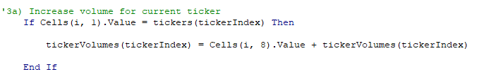
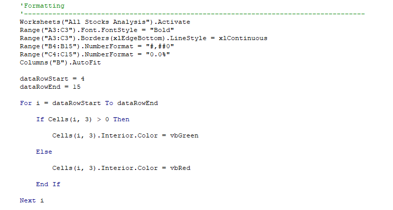
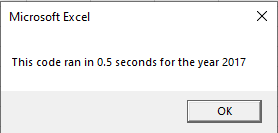
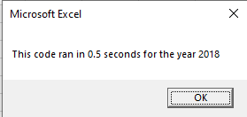

# Stocks Analysis (& Refactoring) 

## Overview

This is a script showcasing a basic analysis of a set of fictitious stocks for a client. The purpose of this analysis is to rapidly identify high performing green energy stocks by parsing through annual historic stock data.

The sample dataset has two spreadsheets, `2017` and `2018`, which contains historic data for 12 different green energy stocks. This data includes open and close dates as well as the volume traded on given dates.

## Results

In order to rapidly analyze these datasets, we opt to use Visual Basic for Applications (VBA), an aging but powerful programming language that comes integrated with Microsoft Excel. This language allows us to loop through all the values in the data set in a matter of seconds and store multiple parameters as variables.

Of note, the two parameters that we're concerned about for each stock is the **total volume** (traded over the year) and the **return percentage**. 

One approach to retrieving this information is to use a **for loop**, a common programming technique which loops through an array or a given number of objects a number of times. It is highly customizable and subject to control flow. We will use this technique, along with VBA's object oriented programming features, **to automatically create a conditionally formatted and easy-to-read report showcasing the most successful stocks for a given year**.

1. We first use an `InputBox` to specify and store the string value of the spreadsheet name (in this case either 2017 or 2018) that we want to analyze. The code then activates the report worksheet, `All Stocks Analysis` and creates a header row which our reported values will fall under.

2. We then initialize an array (list) of all the expected stock tickers in this analysis by stating `Dim tickers(12) As String`. The `12` corresponds to the number of values in this array. We assign each stock ticker to a specific index, such as `tickers(0) = "AY"`. By calling the index `0` in the future, we can access the stored value `"AY"`. This wil be important later on, as calling the same index on different arrays can return different, yet corresponding values.

3. We then activate the previously specified spreadsheet and count the number of rows in the given dataset. This is stored as the variable `RowCount`. This is important to do instead of manually specifying as it allows our code to be **scalable to datasets of different lengths**

4. This step is critical. We initialize a variable, `tickerIndex` and set it equal to 0, as well as define three different arrays `tickerVolumes(12)`, `tickerStartingPrices(12)`, and `tickerEndingPrices(12)`. The `tickerIndex` variable will be iterated upon through our for loop and used instead of an absolute number to simultaneously refer to a given stock ticker's **string value, its traded volume, its starting price and ending price for the year**.

5. The crux of the analysis takes place in the following steps:

- Starting in row 2 (to bypass the header row), we loop to the last row of our dataset as defined by `RowCount`

- Nested in this for loop, we call another for loop `For tickerIndex = LBound(tickers) To UBound(tickers)`. This loops through the lowest index count in the `tickers` array and the highest index count, in this case 0 and 11, and sets this equal to `tickerIndex` as each loop is run. In this case, by looping through each index value in the `tickers` array, we are **looping through each stock in our anticipated analysis**.

- Next, we use control flow to assess each parameter of our desired output. First, we check that the current row is equal to the stock we are assessing. If it is not, the for loop passes and checks the next row. If it is, it adds the current row's (or the current day's) traded volume to the `tickerVolumes` array for the given index. If we are looping through index `0`, then we expect that every row with the value in Column A that is `"AY"` (from the `tickers` array) to be looped through and each volume added to the `tickerVolumes` array. 

- Following this, we want to identify the starting and ending prices for the given stock in order to calculate performance. To do this, we opt to **divide the ending price, or the price the stock had on the last day it was traded in a year, by the starting price (the price on the first day of the year)**. 

- Logically, we can assume that since stocks are sorted in sequential order (all trade records for AY precede CSIQ, for example), that **if the value in Column A, row n-1 is not equal to the value in Column A, row n**, then we have started a new row, and therefore begun analyzing a new stock. Similarly, to find the ending price, we compare **Column A, row n+1 against Column A, row n**. For each run of this loop, we store these as `tickerStartingPrices(tickerIndex)` and `tickerEndingPrices(tickerIndex)`, respectively.

6. Finally, within the outer loop, we report each ticker (based off its index) in sequence. The output is then formatted accordingly, coloring stocks that performed positively in green and negatively in red, as well as some borders and bold face text to enhance readability

## Summary

### General advantages and disadvantages

In general, code is refactored in order to improve its performance, readability, or scalability, among other reasons. These three facets are critical to clean and valuable code as lacking in any of the three can result in compromises in overall quality and pose a risk, whether technical or managerial, in the future. 

Poorly performing code in general, for example, can be taxing for the end-user's system and may cause crashes, depending on their hardware specifications. In less demanding situations, the code can just be slower, which can daisy-chain and cause even slower downstream effects. 

Unreadable code using magic numbers, for example, is problematic because if there's a turnover in staff, newly onboarded staff may not be best positioned to work with unreadable code. Magic numbers may prevent scalability when additional data is required to be analyzed.

Alternatively, there are disadvantages to refactoring code; from a management perspective, rework or refactoring code is costly and most dogma dictates that "quality is built in", not implemented after the fact.

Furthermore, refactoring small sections of code may work independently, but without thorough quality control, may introduce unforeseen bugs when merged into the main branch of a program.

### Refactoring our VBA script

Our refactored VBA script involved the creation of a harmonized set of arrays and a pointer to these arrays, `tickerIndex`. Since each array was originally anchored to the string value given in the `tickers(12)` array, each index position defined by this array corresponded to a single stock. By using the same index value (0-11), we could access all pieces of information of a given stock. Therefore, instead of looping through every row and every column of every cell in the dataset indiscriminantly and using control flow to decide where to store which value, the refactor accessed the specific value at the given index and accessed a set of specific cells and loops through every row exactly **once**. Additionally, using `tickerIndex` avoided the use of magic numbers to reference tickers, improving the readability of the code.

The net result is the resulting performance timers, improved by approximately 12% from my original code (0.56s to 0.5s for both datasets)

